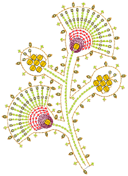

# Applied Decoration

EmbroideryStudio provides support for many multi-decoration techniques, including print.

## Mixed decoration

This section outlines techniques involved in outputting embroidery as virtual decoration. It covers combining virtual embroidery with print as well as virtual with actual embroidery. It also covers EmbroideryStudio support for cording and boring. [See Mixed Decoration for details.](../mixed/Mixed_Decoration)

## Sequin embroidery

This section describes how to set up sequin palettes for sequin designs and how to visualize sequin designs. It explains how to create single-sequin as well as multi-sequin runs. It also covers sequin fixings as well as reshaping and editing. [See Sequin Embroidery for details.](../sequin_basics/Sequin_Embroidery)

## Advanced sequins

This section describes how create sequin fills, both single- and multi-sequin, with and without borders. It discusses fancy sequin fills as well as flip sequins. It also covers editing sequin fills and converting objects to sequins. It deals with single sequin digitizing and custom sequins as well as outputting sequin designs. [See Advanced Sequins for details.](../sequin_advanced/Advanced_Sequins)

## Bead embroidery

This section describes how to set up bead palettes and how to visualize bead designs. It explains how to create single-bead as well as multi-bead runs. It also covers bead fixings as well as reshaping and editing. It also deals with individual bead drops. [See Bead Embroidery for details.](../beading/Bead_Embroidery)

## Bling digitizing

This section describes how to digitize with rhinestones. It covers setting up bling palettes and describes creating bling runs and fills. It also deals with modifying bling objects and bling text. [See Bling Digitizing for details.](../bling/Bling_Digitizing)

## Appliqué embroidery

This section describes different techniques for creating appliqué including how to convert vector graphics to appliqué, how to digitize appliqué objects from scratch, as well as how to convert Complex Turning objects to appliqué. It also covers creating partial cover appliqué for overlapping objects as well as how to break up multiple appliqué and recombine components for efficient stitchout. [See Appliqué Embroidery for details.](../applique/Appliqué_Embroidery)

## Multi-decoration output

Designs digitized in EmbroideryStudio and CorelDRAW® can be output in a variety of ways, both via the Wilcom Workspace and CorelDRAW Graphics. This section covers printing designs in CorelDRAW Graphics as well as exporting designs as vectors. It also covers the Export Multi-Decoration Files capability as well as outputting appliqué and bling to machines. [See Multi-Decoration Output for details.](../export/Multi-Decoration_Output)
