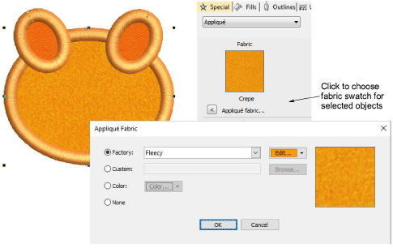

# Add fabric swatches to appliqué

|            | Right-click Appliqué > Appliqué to choose fabric swatch for selected appliqué objects. |
| -------------------------------------------------------- | -------------------------------------------------------------------------------------- |
|  | Use View > Show Appliqué Fabric to toggle the appliqué fabric display on/off.          |

EmbroideryStudio lets you select a fabric swatch for appliqué objects. The swatch becomes a property of the object. Choose from amongst the included ‘factory’ swatches or choose a scanned sample of the fabric you want to use. Use the Show Appliqué Fabric toggle to turn it on or off.

## Related topics...

- [Adjust guide run settings](Adjust_guide_run_settings)
- [Adjust tack stitch settings](Adjust_tack_stitch_settings)
- [Adjust cover stitch settings](Adjust_cover_stitch_settings)
- [Adjust frame-out positions](Adjust_frame-out_positions)
