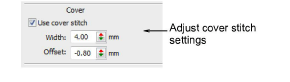
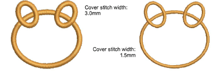
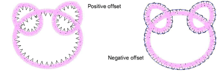
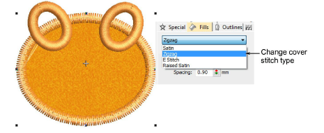

# Adjust cover stitch settings

|                          | Right-click Appliqué > Appliqué to adjust cover stitch settings.               |
| ---------------------------------------------------------------------- | ------------------------------------------------------------------------------ |
|  | Right-click Appliqué > Appliqué without Holes to adjust cover stitch settings. |

The cover stitch is generally the satin border around the [appliqué](../../glossary/glossary#applique) shape. However, you don’t have to include it. Optionally, you can change the cover stitch type to zigzag, E stitch or raised satin. You can also adjust width and offset relative to other appliqué components.

## To adjust cover stitch settings...

- Double-click an appliqué object to access object properties.
- Optionally, turn off cover stitching via the checkbox.

- Adjust cover stitch Width as preferred.

- Optionally, adjust Offset values. A negative offset moves the border inwards relative to the tack stitch. A positive value moves it outwards.

- For more or less dense cover stitching, change stitch types via the Object Properties > Fill tab. Adjust Spacing values accordingly.

