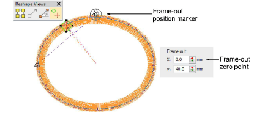
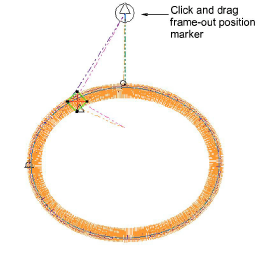

# Adjust frame-out positions

|                          | Right-click Appliqué > Appliqué to adjust frame-out settings.               |
| ---------------------------------------------------------------------- | --------------------------------------------------------------------------- |
|  | Right-click Appliqué > Appliqué without Holes to adjust frame-out settings. |
|                          | Use Reshape > Reshape Object to reposition frame-out marker.                |

When stitching out [appliqué](../../glossary/glossary#applique) objects, you can set a [frame-out](../../glossary/glossary) position after the guide run and/or tack stitch. This shifts the hoop out from under the needle, making it easier to place and trim the appliqué. Depending on the machine you are working with – multi-head or single-head – the frame-out command must be specified as a Stop function or Color Change respectively.

## To adjust the frame-out position...

- Select the object and click the Reshape Object icon.

Control points appear along with the Reshape Views toolbar. Appliqué objects include a frame-out position marker. Show Entry/Exit Points must be activated to view it.

- Click and drag the frame-out marker to the required position.

- If you are using Object Properties, the Frame Out panel lets you specify frame-out coordinates in relation to the top center of the design, which is the zero point.

## Related topics...

- [Reshaping embroidery objects](../../Modifying/reshape/Reshaping_embroidery_objects)
