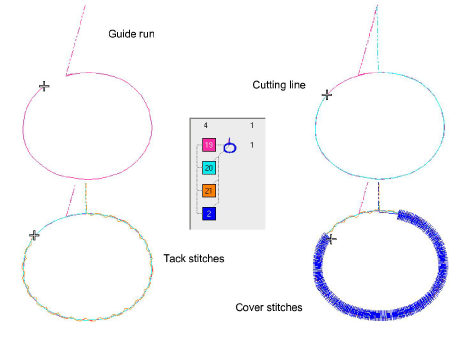

# Adjust guide run settings

|                          | Right-click Appliqué > Appliqué to adjust guide run settings.               |
| ---------------------------------------------------------------------- | --------------------------------------------------------------------------- |
|  | Right-click Appliqué > Appliqué without Holes to adjust guide run settings. |

The guide run is the first layer to be stitched and is used to position appliqué fabric on the background material. An extra [cutting line](../../glossary/glossary) can be added if the fabric is to be trimmed in position. You can also specify a [frame-out](../../glossary/glossary) movement in order to place the appliqué patch.

## To adjust guide run settings...

- Double-click the appliqué object to access object properties.

- Select a cutting method:

| Option        | Function                                                                                                     |
| ------------- | ------------------------------------------------------------------------------------------------------------ |
| Pre-cut       | No cutting line is generated. This assumes you have a pre-cut appliqué patch ready to be placed in position. |
| Trim-in-place | An additional cutting line is generated.                                                                     |

A [cutting line](../../glossary/glossary) allows trim the fabric after the cutting line has been stitched.

- Optionally, adjust Stitch length and Offset values in the Guide Run panel. A negative offset moves the guide run within the outline, a positive value moves it outside.

- Optionally, set a Frame Out after the guide run in order to place the appliqué patch. Depending on the machine you are working with – multi-head or single-head – the frame-out command must be specified as a Stop function or Color Change respectively.

## Related topics...

- [Adjust frame-out positions](Adjust_frame-out_positions)
- [Digitize appliqué objects](Digitize_appliqué_objects)
