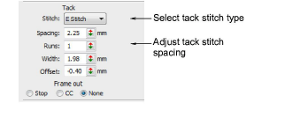
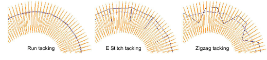
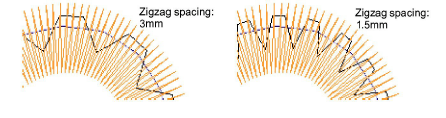
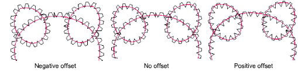

# Adjust tack stitch settings

|                          | Right-click Appliqué > Appliqué to adjust tack stitch settings.               |
| ---------------------------------------------------------------------- | ----------------------------------------------------------------------------- |
|  | Right-click Appliqué > Appliqué without Holes to adjust tack stitch settings. |

Tacking is used to fix [appliqué](../../glossary/glossary#applique) shapes to a background fabric before [cover stitching](../../glossary/glossary) is applied. You can adjust settings or omit this layer altogether. You can also specify a [frame-out](../../glossary/glossary) movement in order to trim the appliqué patch.

## To adjust tack stitch settings...

- Double-click an appliqué object to access object properties.

- In the Tack panel, select a tack stitch type from the droplist. Alternatively, select None.

- Adjust tack stitch settings according to selected stitch type:

| Option  | Function                                                                                                               |
| ------- | ---------------------------------------------------------------------------------------------------------------------- |
| Length  | Stitch length value for Run stitch.                                                                                    |
| Runs    | E Stitch only. Number of runs between stitches.                                                                        |
| Spacing | Stitch spacing value for E Stitch and Zigzag.                                                                          |
| Count   | Number of stitch repetitions for Zigzag only.                                                                          |
| Width   | Column width value for Zigzag and E Stitch.                                                                            |
| Offset  | Run stitch only. Negative offset value moves the tack stitching within the outline, a positive value moves it outside. |

- Optionally, adjust Offset values. A negative offset moves the tack stitch inwards relative to the guide run. A positive value moves it outwards.

- Optionally, set a Frame Out after the tack stitching in order to trim the appliqué patch. Depending on the machine you are working with – multi-head or single-head – the frame-out command must be specified as a Stop function or Color Change respectively.
