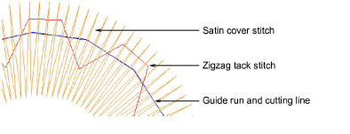

# Adjusting appliqué settings

Whether you create appliqué from scratch using the Appliqué tool, or convert existing vector graphics or Complex Turning objects, EmbroideryStudio produces all the stitching you need. Up to four layers – [guide runs](../../glossary/glossary), [cutting lines](../../glossary/glossary), [tack stitches ](../../glossary/glossary)and [cover stitches ](../../glossary/glossary)– can be generated. Each of these layers can be adjusted via Object Properties.

When you stitch out an appliqué object, the machine stops between layers. EmbroideryStudio also allows you to pre-set a [frame-out](../../glossary/glossary) movement which shifts the hoop from under the needle, making it easier to place and trim appliqué shapes.

Tip: If you want to pre-set appliqué settings, right-click the Appliqué icon with no objects selected. When property values are changed, settings will apply to all newly created appliqué objects in the current session. [See Working with object properties for details.](../../Digitizing/properties/Working_with_object_properties)

## Related topics...

- [Add fabric swatches to appliqué](Add_fabric_swatches_to_appliqué)
- [Adjust guide run settings](Adjust_guide_run_settings)
- [Adjust tack stitch settings](Adjust_tack_stitch_settings)
- [Adjust cover stitch settings](Adjust_cover_stitch_settings)
- [Adjust frame-out positions](Adjust_frame-out_positions)
