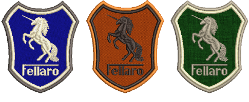

# Appliqué Embroidery

Automatically create all the stitching you need for [appliqué](../../glossary/glossary) using the Appliqué tools. Up to four layers of stitching – [guide runs](../../glossary/glossary), [cutting lines](../../glossary/glossary), [tack stitches ](../../glossary/glossary)and [cover stitches ](../../glossary/glossary)– can be generated for any appliqué object.

Print a copy of appliqué patterns to use in cutting out fabric pieces. Each piece is numbered according to the stitching sequence. You can also output appliqué shapes to cutter or separate file.

## Related topics...

- [Creating appliqué embroidery](Creating_appliqué_embroidery)
- [Adjusting appliqué settings](Adjusting_appliqué_settings)
- [Combining appliqué](Combining_appliqué)
- [Outputting appliqué](Outputting_appliqué)
