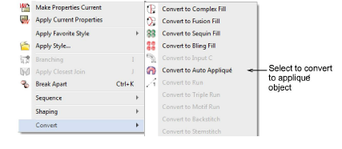

# Convert embroidery objects to appliqué

You can convert complex fill and other objects to appliqué by adding entry, [exit points](../../glossary/glossary) and [frame-out](../../glossary/glossary) position.

## To convert embroidery objects to appliqué...

1Right-click an object and select Convert and the icon from the popup menu.

2Click the outline to set the stitch entry and exit points or press Enter to accept the defaults.

3Mark a frame out position or press Enter to accept the default.

The object is converted and stitches regenerated.

## Related topics...

- [Cut appliqué shapes](../export/Cut_appliqué_shapes)
