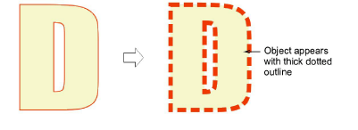
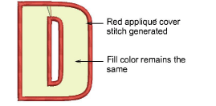
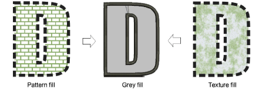

# Convert vector graphics to appliqué

|                              | Use Mode > Tag as Appliqué to tag a vector object for conversion to appliqué.                                        |
| -------------------------------------------------------------------------- | -------------------------------------------------------------------------------------------------------------------- |
|  | Use Mode > Convert Graphics to Embroidery to convert selected graphics to embroidery and switch to Wilcom Workspace. |

In CorelDRAW Graphics, the Tag as Appliqué button allows you to tag selected vector objects for conversion to appliqué.

## To convert a vector graphic to an appliqué object...

1. Create or open a vector graphic in CorelDRAW Graphics and select it.

2. Click Tag As Appliqué. The object is tagged for conversion with a thick dotted outline. The CorelDRAW® Object Manager also indicates which objects have been tagged as appliqué.

3. Click Convert Graphics to Embroidery. EmbroideryStudio automatically converts the vector object to appliqué and switches to Wilcom Workspace.

::: info Note
When present, vector fill properties are maintained in Wilcom Workspace to give the appearance of a fabric patch. Otherwise, fills are rendered in gray.
:::

::: info Note
The success of the conversion can be affected by font size as a proportion of cover stitch width. Where the cover stitch is too thick for the resulting object, it may be ignored.
:::

## Related topics...

- [Adjusting appliqué settings](Adjusting_appliqué_settings)
- [Cut appliqué shapes](../export/Cut_appliqué_shapes)
