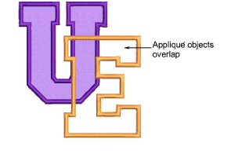

# Create partial cover appliqué

|                          | Use Appliqué > Appliqué to digitize partial cover appliqué objects.                                                                                              |
| ---------------------------------------------------------------------- | ---------------------------------------------------------------------------------------------------------------------------------------------------------------- |
|  | Right-click Appliqué > Appliqué without Holes to digitize partial cover appliqué objects.                                                                        |
|                      | Use Appliqué > Partial Appliqué to create partial cover stitching for overlapping appliqué objects.                                                              |
|                        | Use Appliqué > Remove Overlaps to remove underlying layer of stitching in overlapping objects using the selected object as a ‘cutter’. Right-click for settings. |

You can create appliqué objects with partial cover stitching without doubling-up borders with Partial Appliqué. In combination with the Remove Overlaps tool, you can remove all underlying stitching.

## To create partial cover appliqué...

- Digitize appliqué shapes with Appliqué.

- If you only want to remove underlying cover stitching, select both objects and click Partial Appliqué. Cover stitches are generated in a clockwise direction between start and end points, leaving the rest of the boundary unstitched.

- If you want to remove all underlying stitching, first select the ‘cutter’ object and select Arrange > Remove Overlaps or right-click the tool.

- Set the cutting overlap to half the width of the cover stitching – e.g. 2mm – and click OK.

- Select all objects and click Partial Appliqué to remove underlapping cover stitching.

- Remove any unwanted fragments and zoom in to check the overlaps.

## Related topics...

- [Digitize appliqué objects](Digitize_appliqué_objects)
- [Removing underlying stitching](../../Quality/quality/Removing_underlying_stitching)
