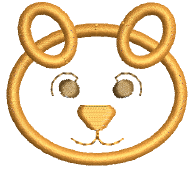
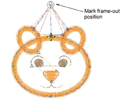
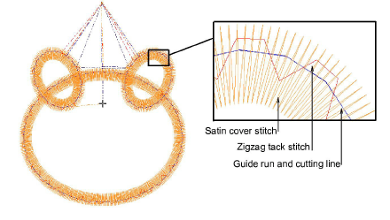
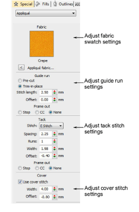

# Digitize appliqué objects

|                          | Use Appliqué > Appliqué to digitize appliqué objects with up to four layers of stitching – guide runs, cutting lines, tack stitches, and cover stitches.                               |
| ------------------------------------------------------------ | -------------------------------------------------------------------------------------------------------------------------------------------------------------------------------------- |
|  | Use Appliqué > Appliqué without Holes to digitize single-boundary appliqué objects with up to four layers of stitching – guide runs, cutting lines, tack stitches, and cover stitches. |

Use Appliqué to produce the stitching you require for [appliqué](../../glossary/glossary#applique) objects. Up to four layers of stitching – [guide runs](../../glossary/glossary#guide-runs), [cutting lines](../../glossary/glossary#cutting-lines), [tack stitches ](../../glossary/glossary)and [cover stitches ](../../glossary/glossary)– can be generated. When you stitch out an appliqué object, the machine stops between layers. Appliqué also allows you to set a [frame-out](../../glossary/glossary) position which shifts the hoop from under the needle, making it easier to place and trim appliqué patches.

## To digitize appliqué objects...

1. Click the Appliqué icon and digitize the boundary of the shape. Follow the prompts. If you make a mistake, press Backspace to delete the last reference point.

::: tip
If you only need to create a single-boundary appliqué object, you may prefer to use the Appliqué without Holes tool.
:::

2. Press Enter to close the shape. You can create another appliqué object at this stage.

3. Press Enter again.

4. Click the outline to set entry and [exit points](../../glossary/glossary) or press Enter to accept defaults.

5. If prompted to do so, mark the [frame-out](../../glossary/glossary) position or press Enter to accept the default.

Frame-out commands are specified as a Stop function or Color Change respectively. They can be set after guide run and/or tack stitch.

6. Press Enter. Up to four layers of stitching – [guide run](../../glossary/glossary), cutting line, tack and cover – are generated, depending on current settings.

7. Double-click the appliqué object to check the settings.

8. Adjust settings as required:

- Fabric swatch: [See Add fabric swatches to appliqué for details.](Add_fabric_swatches_to_appliqué)
- Guide run: [See Adjust guide run settings for details.](Adjust_guide_run_settings)
- Tack stitch: [See Adjust tack stitch settings for details.](Adjust_tack_stitch_settings)
- Cover stitch: [See Adjust cover stitch settings for details.](Adjust_cover_stitch_settings)

9. Optionally, apply [Smart Corners](../../glossary/glossary) to appliqué objects.

10. Optionally, run Stitch Player or use the travel tools to check the appliqué stitching sequence.

## Related topics...

- [Embroidery digitizing](../../Digitizing/input/Embroidery_digitizing)
- [Adjust frame-out positions](Adjust_frame-out_positions)
- [Controlling corner stitching](../../Quality/quality/Controlling_corner_stitching)
- [Viewing stitching sequence](../../Basics/view/Viewing_stitching_sequence)
- [Cut appliqué shapes](../export/Cut_appliqué_shapes)
