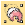
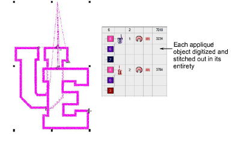
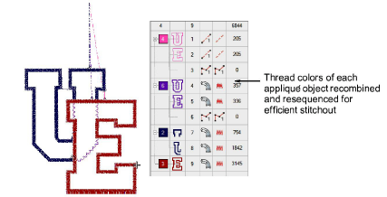

# Resequence appliqué components

|  | Use Appliqué > Combine Appliqué Components to break apart multiple appliqué objects into component objects and combine and resequence them for efficient stitchout. |
| -------------------------------------------------- | ------------------------------------------------------------------------------------------------------------------------------------------------------------------- |

The Combine Appliqué Components tool breaks multiple appliqué objects into their components – [guide runs](../../glossary/glossary), [cutting lines](../../glossary/glossary), [tack stitches ](../../glossary/glossary)and [cover stitches ](../../glossary/glossary)– and combines and resequences them for efficient stitchout. The end result is that the guide run of all appliqué objects is stitched in one pass, followed by the tack stitch and then cover stitch. A single frame-out movement occurs after guide run and tack stitch components.

## To resequence appliqué components...

1. Select a group of appliqué objects. The Combine Appliqué Components tool is activated.

2. Click Combine Appliqué Components. A message box warns that the appliqué objects will be broken apart and recommends that you save the design before proceeding.

3. Click OK to confirm. The selected appliqué objects are broken apart and same components – [guide runs](../../glossary/glossary), [cutting lines](../../glossary/glossary), [tack stitches ](../../glossary/glossary)and [cover stitches ](../../glossary/glossary)– combined and resequenced.

