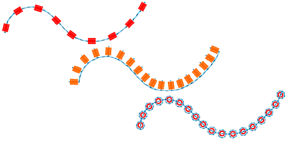
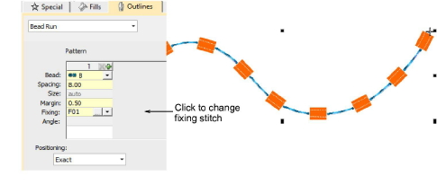
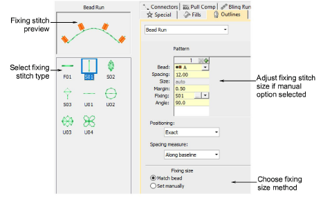
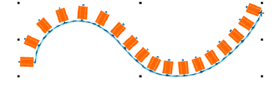
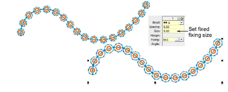
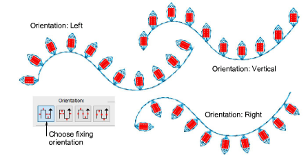

# Apply bead fixings

|  | Use Bead > Bead Palette to select from a user-defined palette of bead shapes for the current design. |
| ---------------------------------------------------- | ---------------------------------------------------------------------------------------------------- |

You can select beads before or after digitizing. Similarly, you can preset fixing stitches or change them at any stage.

## To apply bead fixing stitches...

- To change fixing stitches, double-click to access object properties.

- Click the ‘...’ button in the Fixing field. The docker expands to display a library of fixing stitch types.

- Select the preferred style – ‘upright’, ‘flat’, ‘sideways’.

- To adjust fixing stitch size, select a method:

| Method       | Function                                                                                   |
| ------------ | ------------------------------------------------------------------------------------------ |
| Match bead   | Automatically sets a margin around the bead so that fixing stitches don’t punch too close. |
| Set manually | Activates the Size field and lets you set a fixing stitch size independent of bead size.   |

- If you choose ‘set manually’, specify a value in the Size field. Size is measured from the center of the bead. Enter a value from 2.50mm to 30.00mm.

- If you choose automatic matching, specify a margin for the fixing stitch in the Margin field. Enter a value from 0.20mm to 2.00mm. This ensures that the fixing stitch does not punch too close to the bead.
- To adjust fixing orientation, choose one of the preset directions – left/right, up/down.

## Related topics...

- [Create sequin fixings](../sequin_advanced/Create_sequin_fixings)
