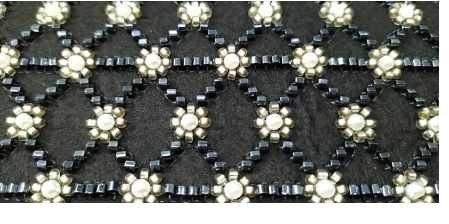

# Bead Embroidery

Bead embroidery is a type of applied decoration where beads, like sequins, are stitched rather than glued to fabric, suede, or leather. Unlike woven, knitted, and crocheted beading, embroidered beading does not form part of the fabric structure. Traditionally, it has been used on garments and decorative textiles. Accessories such as handbags or belt buckles may also be embellished with bead embroidery. As may household items such as pillowcases or cushions.

Embroidery machines can be equipped with a device that drops beads onto fabric as it stitches, similar in principle to sequin embroidery. EmbroideryStudio includes a Beading capability which supports beading devices. A library of beads of different size, shape and color, is available, together with fixing stitches supporting classic upright, flat and sideways beading.

This section describes how to set up bead palettes and how to visualize bead designs. It explains how to create single-bead as well as multi-bead runs. It also covers bead fixings as well as reshaping and editing. It also deals with individual bead drops.

## Related video

<iframe src="https://www.youtube.com/embed/jjXFmGF6HEE" title="YouTube video player" 
		 frameborder="0" allow="accelerometer; autoplay; clipboard-write; encrypted-media; gyroscope; picture-in-picture" 
		 allowfullscreen="" style="width: 560px; height: 315px;">
</iframe>

## Related topics

- [Beading mode](Beading_mode)
- [Creating bead runs](Creating_bead_runs)
- [Bead fixings](Bead_fixings)
- [Editing bead runs](Editing_bead_runs)
- [Manual bead digitizing](Manual_bead_digitizing)
- [Bead encoding & decoding](Bead_encoding_decoding)
