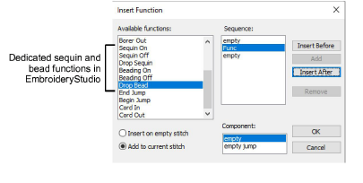
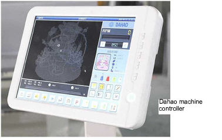
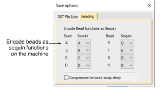
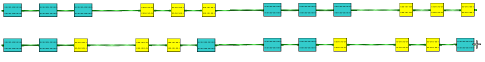
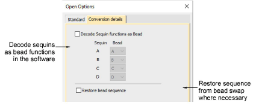

# Bead encoding & decoding

In EmbroideryStudio, dedicated ‘Bead’ functions are used for bead designs. Analogous functions exist for sequins.

When exporting to Tajima DST file format, both ‘Drop Bead’ and ‘Drop Sequin’ functions are replaced by Jump codes. When exporting to DST format with Dahao as your selected machine format, the machine file employs a modified protocol for non-standard use of Jump codes. This is a modified Dahao-specific DST format.

## Encode beads as sequins

You do not need to be concerned with machine file encoding unless your design contains both sequins and beads. Since both object types are encoded the same way in the machine file, you need to explicitly map beads and sequins to respective ‘slots’ on the machine. You do this on output via the Save Options dialog. Droplists on the Save Options > Beading tab are available whenever you export as Tajima DST with Dahao as your current machine format.

Let’s say your design contains two (2) sequins and two (2) beads. And let’s say your machine is configured with sequins in Slots A and B, and beads in Slots C and D. On the Beading tab, Bead A must map to Sequin C and Bead B to Sequin D. Then the Dahao controller will be able to correctly distinguish sequins from beads on stitchout.

Note that this mapping is not indicated on the production worksheet since it only affects the machine file, not the source design file. This means the designer must communicate the correct mapping to the machine operator (or vice versa) according to how sequins and beads are configured. It is important to make sure that mappings do not intersect. For instance, you do not want both Bead A and Sequin A to be allocated to Slot A.

Note: DST files can only encode up to four (4) sequins and/or beads. This means that if you have, say, 3 sequins and 5 beads in the same design, mapping will not work. You will run out of slots.

## Compensate for bead-switch delay

Some machine configurations have a specific deficiency when it comes to beading. Namely, they are one step late when switching beads. When controllers encounter a command to drop Bead X, the machine will drop whatever bead is in the picker and only then make the switch.

To correct the error, you must compensate by employing a ‘preemptive bead swap’. This will shift bead changes by one step. By ticking Compensate for bead swap delay, the first line becomes re-encoded as shown...

Note: Installation engineers will be able to advise if it is necessary to compensate for ‘bead shift’.

## Decode sequins as beads

The Open Options dialog provides an inverse set of controls to decode machine files which have been encoded by means of the Save Options > Beading mechanism. The Open Options > Conversion Details tab allows you to decode sequin functions as beading when opening these formats using Dahao target machine.

Note: When you open a Tajima DST file, the software only shows the Standard tab. When you choose ‘Dahao’ from the machine type droplist, the Conversion Details tab becomes available.

## Related topics...

- [Select bead-capable machines](Select_bead-capable_machines)
- [Opening machine files](../../Production/convert/Opening_machine_files)
- [Exporting designs for machine](../../Production/output/Exporting_designs_for_machine)
