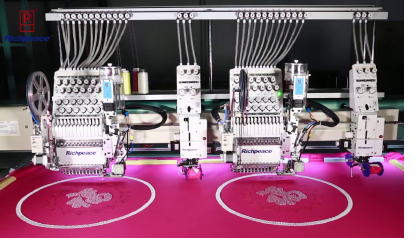

# Bead fixing considerations

Fixing type is independent of device type. The bead is always dropped in the same way. Fixing stitches control bead orientation. However, different machines and dispensers have their own production requirements and idiosyncrasies.

## Bead production vs sequin production

Bead production is more exacting than sequin production. While sequin devices used to have similar issues, they have matured to the point where they can manage all kinds of fixing types at high speed. Moreover, sequin materials are more forgiving. Needle penetrations do not generally cause serious problems. The minimum commercial operating speed for bead production is 800 rpm or higher. Typical problems which can occur at high speed:

- Beads are missed
- Beads are smashed
- Needles are broken.

## Testing for high speed production

You may need to modify or ‘tweak’ predefined fixing types provided by the software in order to run reliably at high speed. This will involve testing on the machine. While fixing stitches in EmbroideryStudio automatically adapt to bead size, each bead type will need to be tested separately. Generally speaking, bead production can be stabilized when running machines at low speed, say, 600 rpm. This is suitable for testing.

A typical scenario might be:

- Develop a bead embroidery design.
- Carry out a sampling test at low speed.
- Test at production speed in order to calculate costs.
- Assess whether bead fixing meets high speed requirements – e.g. beads are missed or smashed.
- Adjust bead fixings and test again.

## Options for editing bead fixings

Options available in EmbroideryStudio for bead designers are:

- Modify or ‘tweak’ fixing stitches by means of object properties. This may involve:
- Trying out different fixing stitch types
- Testing automatic as well as fixed spacings
- Modifying margin settings.
- Edit bead fixings with the Bead Edit tool.
- Digitize bead drops with the Manual Bead tool.
- Insert bead drops with the Insert Function capability.
- Create your own bead fixings and save them as custom motifs.
