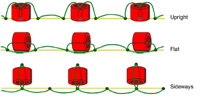

# Bead fixings

EmbroideryStudio provides a library of predefined fixing stitches for use with bead runs. Generally digitizers reserve a single thread color for all beads, regardless of bead color. Transparent thread is often used in order to avoid differences between thread color and bead color. Various layout methods are available. EmbroideryStudio supports the classic types – ‘upright’, ‘flat’, and ‘sideways’ – as well as variants. Fixing stitches are generally not part of the decoration.

## Related topics...

- [Bead fixing considerations](Bead_fixing_considerations)
- [Apply bead fixings](Apply_bead_fixings)
