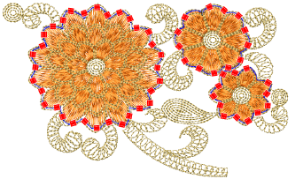

# Beading mode

Before using the Bead tools, you must select a machine format that supports bead output. You can then set up a dedicated palette for your design from a list of shapes. Each can be adjusted in size, height and color.

## Related topics...

- [Machine beading](Machine_beading)
- [Select bead-capable machines](Select_bead-capable_machines)
- [Visualize bead designs](Visualize_bead_designs)
