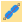
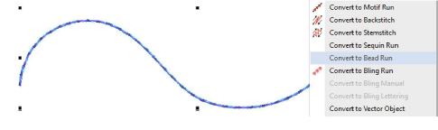
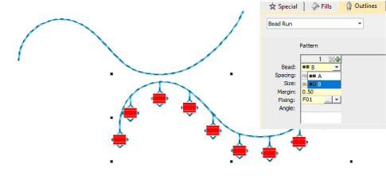

# Convert objects to bead runs

|  | Use Bead > Bead Run Auto to create a string of beads along a digitized line according to current settings. |
| ---------------------------------------------------- | ---------------------------------------------------------------------------------------------------------- |

Most objects in EmbroideryStudio are inter-convertible. Bead runs are no exception. Any outline object – Run, Stemstitch, Motif Run, Freehand, Column C, Vector – can be quickly converted to bead run.

## To convert an object to a bead run...

- Select the object – Run, Stemstitch, Motif Run, Freehand, Column C, or Vector.
- Right-click and select Convert > Convert to Bead Run.

- Alternatively, click the Bead Run Auto icon.

- Double-click to access object properties.
