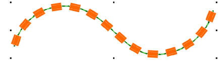

# Create patterned bead runs

|  | Use Bead > Bead Run Auto to create a string of beads along a digitized line according to current settings. |
| ---------------------------------------------------- | ---------------------------------------------------------------------------------------------------------- |
|  | Use Docker > Object Properties to toggle the docker on/off. Set properties for the current design.         |

With EmbroideryStudio, you can create bead run patterns for immediate use. Patterns generally involve multi-bead drops.

## To create a patterned bead run...

- Create a bead-run object with Bead Run Auto or select an existing object. This allows you to preview your pattern as you go.

- Select the bead combination you want to use.

- Open Object Properties. The Pattern table displays beads currently available.

- Add or remove beads via the + and X buttons in the column header.
- Select a bead from the droplist. The selected sample updates immediately.
- In the Spacing field, enter a nominal spacing for each bead. By default, spacing is measured along the digitized line.

- In the Fixing field, select the type of fixing you want. Generally you’ll use the same fixing for all beads in the pattern.

## Related topics...

- [Select bead-capable machines](Select_bead-capable_machines)
- [Digitize bead runs](Digitize_bead_runs)
