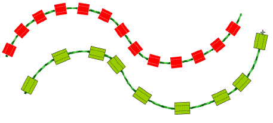

# Creating bead runs

EmbroideryStudio provides tools for creating a string of beads along a digitized line according to preset spacings or as marked by the digitizer.

Digitize bead runs as you would do sequin runs. If you use the manual method, you define spacings between bead-drops with every click you make. If you use the automatic method, bead-drops are calculated according to current Bead Run object properties.

## Related topics...

- [Set up bead palette](Set_up_bead_palette)
- [Digitize bead runs](Digitize_bead_runs)
- [Create patterned bead runs](Create_patterned_bead_runs)
