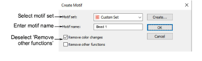

# Custom bead motifs

|            | Use Traditional Digitizing > Use Motif to add motifs to design one-by-one. Rotate, scale, or mirror as you add. |
| ---------------------------------------------- | --------------------------------------------------------------------------------------------------------------- |
|  | Use Outline Stitch Types > Motif Run to create a string of motifs along a digitized line.                       |

Another technique for deploying custom bead fixings is to save them as motifs and use them singly or in motif runs. The Create Motif function lets you save your own motifs for future use. Custom motifs are saved in custom ‘motif sets’.

## To create and save a motif...

1. Create your custom bead and fixing stitch or edit an existing one.

2. Duplicate and align the motif as you want it to appear in a motif run. Use Alignment tools for precise arrangement.

3. Once you have determined the layout, select objects and apply Closest Join. Use the middle motif to determine reference points.

4. Select the motif and choose Object > Create Motif.

5. Select a custom motif set from the droplist and enter a name in the Motif Name field.

6. Deselect the Remove other functions option. This ensures that beads are preserved.

7. Click OK.

8. Click two reference points for the bead motif. These should coincide with entry and exit points.

9. Use you custom bead and fixing in bead runs or individual placements.

## Related topics...

- [Custom motifs](../../Decorative/motifs/Custom_motifs)
- [Selecting & placing motifs](../../Decorative/motifs/Selecting_placing_motifs)
- [Motif runs](../../Decorative/motifs/Motif_runs)
