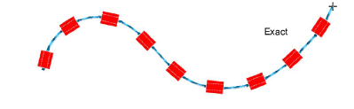

# Digitize bead runs

|      | Use Bead > Bead Run Auto to create a string of beads along a digitized line according to current settings. |                                                                                                      |
| ---------------------------------------------- | ---------------------------------------------------------------------------------------------------------- | ---------------------------------------------------------------------------------------------------- |
|  | Use Bead > Bead Run Manual to manually digitize bead-drops along a digitized line.                         |                                                                                                      |
|      |                                                                                                            | Use Bead > Bead Palette to select from a user-defined palette of bead shapes for the current design. |

Normally beads are stitched last, after motifs and other embroidery are complete. With the Bead Run tools you have the option of digitizing individual bead drops or letting the system generate them for you. Automatic bead runs can be scaled.

## To digitize a bead run...

1. Select a bead-capable machine from the Select Machine Format dialog.

2. Define your palette and select bead shapes you want to use from the droplist, in this case a twin-bead setup.

## To digitize automatic bead placements...

- To digitize a scalable bead run, use the Bead Run Auto tool. Enter reference points – left-click for corner points, right-click for curve points.

- Press Enter to complete. Bead drops are automatically generated along with fixing stitches according to current Bead Run object properties.

::: tip
You can convert a normal run to bead run by selecting and clicking the Bead Run Auto tool.
:::

- Double-click the object to access properties and swap beads as preferred.

- In the Spacing field, enter a nominal spacing. By default, this is measured ‘along baseline’, from one bead drop to the next. Minimum spacing is automatically calculated.

- Adjust Positioning method as preferred:

- Exact: Uses nominal spacing. This may result in gap formation at the end of the path.

- Expand to fit: Expands spacing to evenly spread bead distribution.

- Contract to fit: Contracts spacing to evenly spread bead distribution, sometimes resulting in an extra bead.

- Manual: Turns bead run to ‘manual’ so that the number of beads won’t change when scaling.
- Change the Spacing measure as necessary in order to prevent bead bunching.

- Use Angle to orientate beads in relation to the run line. Fixing stitches are adjusted accordingly.

- Set Angle to -90° to flip bead orientation.

- To change fixing stitches, click the ‘...’ button in the Fixing field. The docker expands to display a library of fixing stitch types. See below.

## To digitize manual bead placements...

- Alternatively, to control the exact placement of your bead drops, use the Bead Run Manual tool. Digitize individual bead drops with left and right mouse-clicks.

- Press Enter to complete. Bead drops are generated at each reference point. Connecting and fixing stitches are automatically generated.

::: info Note
Manual placements can be reset by choosing a different Positioning method. If you change to exact spacing, all drops are recalculated and manual placements lost.
:::
