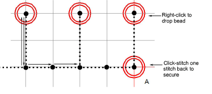

# Digitize manual bead drops

|  | Use Bead > Manual Bead to digitize individual beads. |
| ---------------------------------------- | ---------------------------------------------------- |

The Manual Bead input method allows you individual control over bead placement and fixing stitches. Create decorative bead placements or ‘clusters’ using beads from the palette. To add a bead to the stitching sequence, simply drop it onto the design and secure it with manual stitches.

Note: Manual bead stitching is a difficult digitizing skill to master and you need to plan the stitching sequence carefully in order to minimize unnecessary stitches. Experiment with your machine and stitch length and spacing settings to achieve the desired result.

## To digitize manual bead drops...

1. Select a machine format that supports bead mode via the Select Machine Format dialog. [See Select bead-capable machines for details.](Select_bead-capable_machines)

2. Set up your palette in the Bead Palette Editor according to the machine type – single, twin, multi-bead – that you have selected.

3. Select a color for the fixing stitch from the Color toolbar.

4. Click the Manual Bead icon. If you have activated twin-bead mode, bead options are displayed in the droplist.

Tip: Zoom in for more accurate digitizing. Hold down Ctrl+Shift to constrain the cursor to horizontal and vertical directions, or 15° increments.

5. Select a bead and left-click to begin your manual bead placement. It must start with at least one stitch. How you proceed depends on the layout style you are aiming for. The most common is ‘flat’:

6. One technique for creating a ‘flat’ fixing stitch is as follows:

- Click-stitch forward as manual run stitching.
- Move forward one bead length and right-click to drop a bead. An outline appears.
- Click-stitch backwards. This stitch is going through the hole and will pull the bead back and down.
- Click-stitch forward across the bead to the drop point.

- Click-stitch forward as manual run stitching until you reach the next drop point.

Tip: If you make a mistake while digitizing, press Backspace to retrace your steps.

7. Continue digitizing manually in the same way – right-click to drop a bead, left-click to digitize fixing stitches. Press Enter to finish.

Tip: Remember to test your beading drops on the machine at normal speed (low-to-medium) and then at high speed. Differences will show up at high speed.

8. If you have activated multi-bead mode, press the Tab key to switch between available bead shapes while digitizing.

9. Press Enter to finish.

Tip: Typically, you combine manual bead drops with Run stitch. Use Run to ‘map out’ the design and use Manual Bead to digitize individual bead drops or ‘bead clusters’.

## To digitize sideways fixing stitches...

The recommended technique for creating a ‘sideways’ layout is similar in principle to ‘flat’.

1. Click-stitch forward as manual run stitching.

2. Turn sideways at the point you want to drop the bead.

3. Move forward one bead length and right-click to drop the bead. A bead outline appears.

4. Click-stitch backwards. This stitch is going through the hole and will pull the bead back and down.

5. Click-stitch forward as manual run stitching until you reach the point of the next bead drop.

6. Press Enter to finish.

## To digitize upright fixing stitches...

Below is the ‘classic’ upright layout. In this procedure we add some stitch reinforcement to help position the bead.

1. Click-stitch forward as manual run stitching.

2. Optionally, click-stitch a bead surround in manual run stitching. This will help ‘seat’ the upright bead.

3. Right-click in the center of the surround to drop the bead. A bead outline appears.

4. Click-stitch forwards to the edge of the bead surround. This stitch is going through the hole and will secure the bead in the upright position.

5. Click-stitch forward as manual run stitching until you reach the point of the next bead surround.

6. Press Enter to finish.

## Related topics...

- [Select bead-capable machines](Select_bead-capable_machines)
- [Beading mode](Beading_mode)
