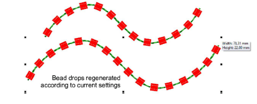
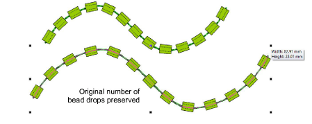
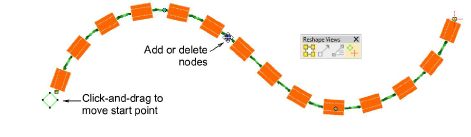
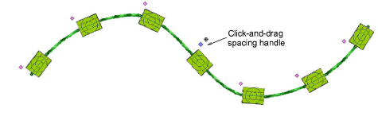
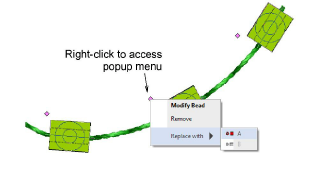
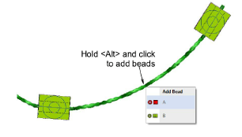
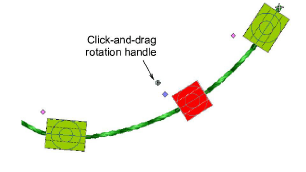
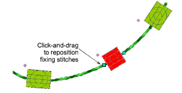

# Edit bead runs

|    | Use Select > Select Object to resize objects using selection handles. |
| ---------------------------------------------- | --------------------------------------------------------------------- |
|  | Use Reshape > Reshape Object to reshape selected bead-run objects.    |
|            | Use Bead > Bead Edit to fine-tune placement of individual beads.      |

You have complete control over editing bead-run objects, from scaling to adding or removing individual beads. You can also manually fine-tune bead spacing and orienation. You can even edit individual fixing stitches.

::: tip
Performing manual edits automatically sets bead positioning to Manual. If you reset to Exact, Contract to fit, or Expand to fit, all manual edits are lost.
:::

## To edit a bead run...

- Scale bead-run objects by clicking and dragging selection handles, or by adjusting general properties.
- With Bead Run Auto objects, bead drops are automatically recalculated.

- With Bead Run Manual objects, the original number of bead drops is preserved while spacing is increased.

- Edit bead runs with Reshape:
- Add nodes by left- or right-clicking the outline.
- To remove a node, select and press Delete.
- Click-and-drag to move the start point. To reverse stitch direction, apply Edit > Reverse > Reverse Curves.

- Fine-tune individual bead spacings with the Bead Edit tool. Click-and-drag a diamond [control point](../../glossary/glossary). Hold down Shift or Ctrl keys to select a range or multiple control points.

- Remove selected beads by pressing Delete or via the popup menu. Use the same menu to replace individual beads from the current palette.

- Add beads from the popup menu by holding down the Alt key and clicking the bead run.

- To rotate an individual bead, click the diamond control point. Use the rotation handle to orient the bead as necessary.

- Click the bead to activate fixing stitches. Use the handles to fine-tune as necessary.

## Related topics...

- [Scaling objects](../../Modifying/transform/Scaling_objects)
- [Reshaping embroidery objects](../../Modifying/reshape/Reshaping_embroidery_objects)
