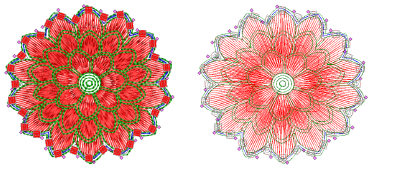

# Editing bead runs

Bead-run objects can be edited like any other embroidery object. Parameters can be adjusted via object properties, or bead runs reshaped and edited, right down to individual bead orientations and fixings.

## Related topics...

- [Convert objects to bead runs](Convert_objects_to_bead_runs)
- [Edit bead runs](Edit_bead_runs)
