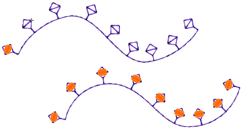
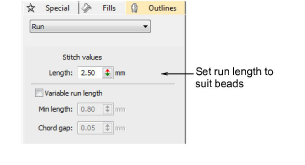
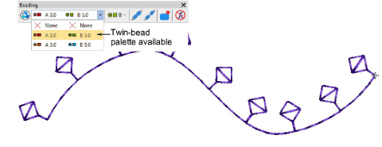
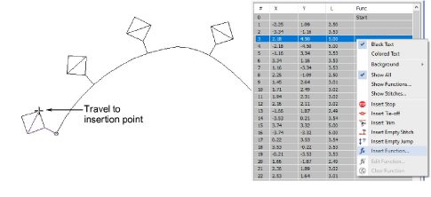
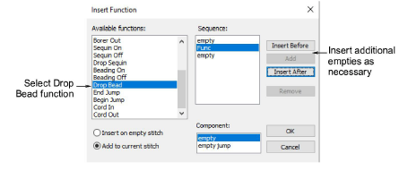
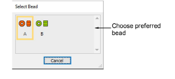
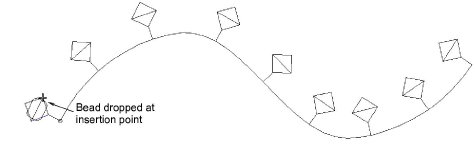
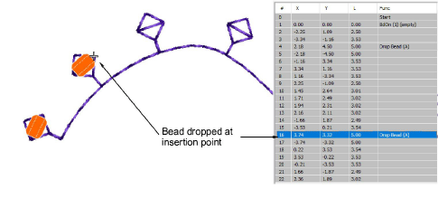

# Insert bead drops

|                        | Use Outline > Digitize Run to place a row of single or triple run stitches along a digitized line.          |
| ------------------------------------------------ | ----------------------------------------------------------------------------------------------------------- |
|              | Use Outline Stitch Types > Motif Run to create a string of motifs along a digitized line.                   |
|          | Use Docker > Stitch List to toggle Stitch List display on and off. Use it to select individual stitches.    |
|    | Use Travel > Travel 1 Stitch to move stitch cursor forwards/backwards 1 stitch at a time. Left/right click. |
|  | Click Function > Insert Function to insert machine function at current stitch cursor position.              |
|    | Use Bead > Clear Function to remove any bead functions from the current needle position.                    |

In preference to the Manual Bead tool, some digitizers flesh out designs using Run or Motif Run and then travel through it, dropping beads manually as and where required. This technique can be used with single or multi-beads.

## To insert bead drops...

1. Select a machine format that supports bead mode via the Select Machine Format dialog.

2. Set up your bead palette – single or more – according to machine capabilities.

3. Set a fixed run length to suit the bead type/s you are using.

4. Create the design or pattern you want and choose the bead or beads to use.

5. Optionally, open the Stitch List.

6. Press the Home button and travel through the design using arrow keys or Travel tools.

7. Travel to the insertion point and select Insert Function from the toolbar or Stitch List popup menu.

8. From the Functions list, select Drop Bead. Depending on machine requirements, you will either add the function to the current stitch, or insert it on an [empty stitch](../../glossary/glossary) or [empty jump](../../glossary/glossary). See your machine manual for details.

9. When the Drop Bead function is correctly defined, click OK. The Select Bead dialog opens showing available beads.

10. Choose a preferred bead. The Drop Bead function, together with any additional empty stitches or jumps, is added at the current needle position.

11. Continue traveling and inserting beads by the same method.

12. To delete a bead drop, travel to the location and click the Clear Bead icon.

## Related topics...

- [Digitizing outlines & details](../../Digitizing/input/Digitizing_outlines_details)
- [Motif runs](../../Decorative/motifs/Motif_runs)
- [Select bead-capable machines](Select_bead-capable_machines)
- [Travel through designs](../../Basics/view/Travel_through_designs)
- [Insert machine functions manually](../../Modifying/functions/Insert_machine_functions_manually)
