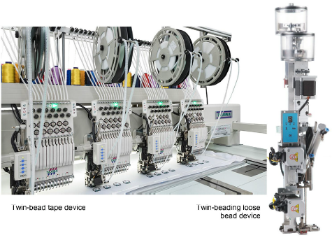
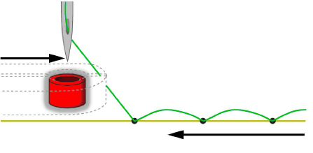

# Machine beading

Capabilities vary but bead devices are not as varied as sequin devices. There are two categories: bead tape and loose beads. For both types of setup, twin-bead configurations are currently the most popular.

Bead tapes, like sequin reels, provide controlled placement of beads on fabric. With loose beads, containers hold them on top of the dispenser. This method is not quite as reliable as beads on tape.

Various layout methods are available on the machine. EmbroideryStudio supports the classic fixing stitch types – ‘upright’, ‘flat’, and ‘sideways’ – as well as decorative variants.

## Related topics...

- [Embroidery machine formats](../../Basics/basics/Embroidery_machine_formats)
