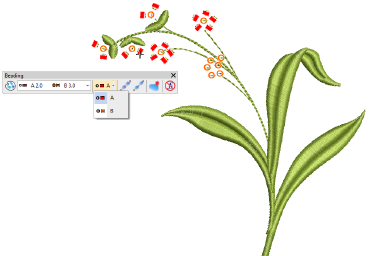

# Manual bead digitizing

If you require precise control over the positioning and encoding of your bead drops, EmbroideryStudio provides manual techniques for this purpose. Digitize your own bead drops with fixings. Even insert individual bead-drop functions while traveling through the design. Or create your own bead fixings for use as custom motifs.

## Related topics...

- [Digitize manual bead drops](Digitize_manual_bead_drops)
- [Insert bead drops](Insert_bead_drops)
- [Custom bead motifs](Custom_bead_motifs)
