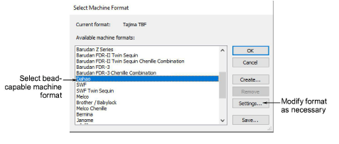
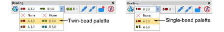
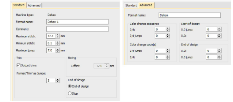

# Select bead-capable machines

Before using the Bead tools, you need to choose a suitable [machine format](../../glossary/glossary). Only some machine formats support beading – e.g. Tajima TBF, Dahao and SWF Twin Sequin. Refer to your machine manual for information about support for this type of decoration.

Note: For machine formats that have no bead capability, the bead palette will display. However, if you attempt to create a bead object, fixing stitches will be digitized without bead drops.

## To select a bead-capable machine...

1Select Design > Select Machine Format.

2From the Available Machine Formats list, select a bead-capable machine format – e.g. Tajima TBF, Dahao.

3Click OK. Default bead shapes are now available for selection from the Bead Palette. If you have selected a twin-bead-capable machine, bead shapes and sizes are displayed in pairs. Up to eight (8) beads can be supported when the Dahao machine format is selected.

Note: Different machines require different presets. Typical modifiable values include stitch and jump length, trim functions and color change functions. Use the Machine Format Settings dialog to customize values if outputting to a specific machine format.

## Related topics...

- [Embroidery machine formats](../../Basics/basics/Embroidery_machine_formats)
- [Exporting designs for machine](../../Production/output/Exporting_designs_for_machine)
