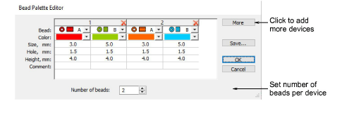
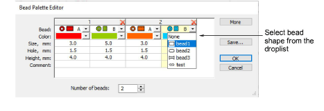
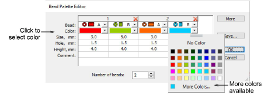
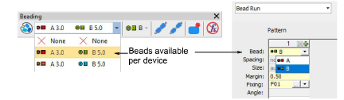

# Set up bead palette

|  | Use Bead > Bead Palette Editor to select shapes from a bead library, and define bead colors and sizes. |
| ------------------------------------------------------ | ------------------------------------------------------------------------------------------------------ |

Use the Bead Palette Editor to prepare a palette of beads for use according to your machine capabilities. Bead devices are normally attached to the first or last needle of the machine head.

## To set up a bead palette...

1. Select the machine format that supports the machine you are using.

2. Click the Bead Palette Editor icon. Fields for each bead are arranged in tabular form.

3. Set the number of beads available per device. Depending on machine type, up to eight (8) beads may be supported. If you have chosen a twin-bead machine, this value is limited to 2.

4. Use the More button to add devices. Click X in the column header to remove.

5. Select a bead from the droplist.

6. Set color, bead and hole size, as well as height.

7. Set up other beads in the same way, and click OK. Beads are available for selection.

## Related topics...

- [Select bead-capable machines](Select_bead-capable_machines)
