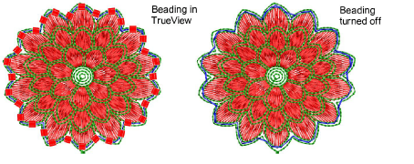
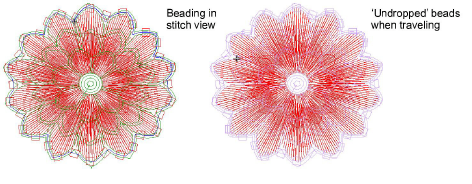

# Visualize bead designs

|            | Click View > TrueView to toggle between stitch view and TrueView™. Right-click for settings.      |
| ---------------------------------------------- | -------------------------------------------------------------------------------------------------- |
|    | Use View > Show Stitches to toggle embroidery stitching display. Right-click for settings.         |
|  | Use View > Show Functions to toggle display of machine function symbols. Right-click for settings. |

Beading can be viewed in TrueView or stitch view while Show Functions is toggled on.

Both beads and fixing stitches appear in their selected colors and can be turned on or off via Show Functions and Show Stitches toggles.

When traveling through a beading design, ‘undropped’ beads appear in the ‘unsewn’ color defined in the Background & Display Colors dialog.

## Related topics...

- [Travel through designs](../../Basics/view/Travel_through_designs)
- [Viewing design repeats](../../Basics/view/Viewing_design_repeats)
- [Change display colors](../../Basics/view/Change_display_colors)
