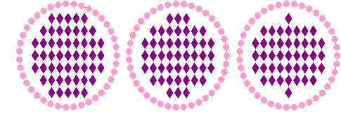

# Add bling borders

Like sequin fills, bling fills can also include a border, with or without a margin. The border can be made from different or same rhinestones and is a property of the bling-fill object.

## To add a border or changing border properties...

1Select the bling-fill object and tick the Border checkbox.

2Use pattern settings to create simple or variegated bling borders.

3Select the bling margin as required.

A border margin is created by adding an ‘offset’ to each individual bling item in the border. Smaller border margins result in a larger number of rhinestones in the fill as shown.

## Related topics...

- [Adding sequin borders](../sequin_advanced/Adding_sequin_borders)
