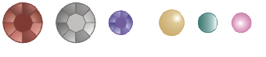
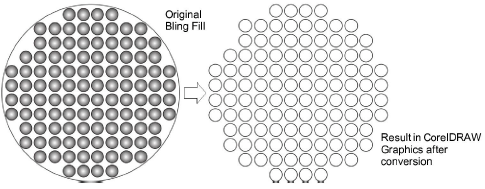
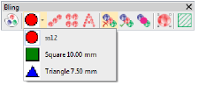

# Bling production processes

The Bling feature allows digitizers to create patterns of bling runs or fills with editing capabilities similar to those of the Sequin toolset. The single biggest difference between Sequin and Bling is that individual rhinestones are not allowed to overlap or be too close together. Another difference is that there is no stitching associated with bling.

Bling, rhinestones, crystals, and glitz are interchangeable terms referring to decorative objects placed on garments or templates. They are supplied in various sizes, shapes, colors and materials.

There are two basic processes for creating bling designs:

- Hot-fix template production
- Direct-to-garment production

## Hot-fix template production

Hot-fix templates can be produced in two ways:

- Bling template: This is the design layout on which rhinestones are initially placed prior to transfer. The template is created by cutters or engravers. Rhinestones are placed onto the template by a manual flood-fill process and then manually transferred to transfer tape.
- Bling transfer: In a semi-automatic process, bling is placed directly onto transfer tape (or sheet) by machine. Examples are IOline CrystalPress and CAMS machines. The bling design is ready for heat transfer to the final product – e.g. a T-shirt.

## Direct-to-garment bling production

Direct-to-garment bling production is supported by many machines. Automatic rhinestone transfer machines are designed for high speed, high volume production. They enable users to fix any type of rhinestones, studs, and so forth directly to any type of fabric.

Tip: If you have neither CAMS automatic rhinestone placement machine nor a direct-connect cutting machine, you can use the Convert Bling for Production command to convert bling objects to vector shapes. These can be then output to vector file for use by third-party applications. [See Outputting bling for details.](Outputting_bling)

## Cutting data

Cutting data sent to machine consists solely of vectors which describe the location, size, and shape of the bling in the template. There are no connecting lines or data that do not relate directly to the placement of the bling. For example:

## Bling templates

Bling templates must have holes cut to suit the bling size to be used. Below is a table of stone size to hole size. ‘SS’ stands for ‘Stone Size’.

| Stone size | Hole size (mm) |
| ---------- | -------------- |
| SS04       | 1.7            |
| SS05       | 1.9            |
| SS06       | 2              |
| SS07       | 2.3            |
| SS08       | 2.5            |
| SS09       | 2.7            |
| SS10       | 2.9            |
| SS12       | 3.2            |
| SS16       | 4              |
| SS20       | 5              |
| SS30       | 6.5            |
| SS34       | 7.3            |
| SS40       | 8.7            |
| SS48       | 11.4           |
| SS60       | 14.3           |

## Bling toolset

The Bling toolbar contains the following tools:

Bling objects have properties like normal embroidery objects. The Object Properties docker contains two tabs called Bling Fill and Bling Run to handle these properties. Editable properties include bling type – size, shape color, facets – patterns, fill density, angle and layout. Bling features include:

- Similar functionality to the Sequin tool.
- predefined library of rhinestone shapes.
- Tools to create outline and fill patterns.
- Controls to adjust placement of stones to avoid overlaps.
- Tools to convert vector outlines to bling patterns.
- Commands to create cut files to send to cutting machine – similar to appliqué.
- Inclusion of bling count by size and color on production worksheet.
