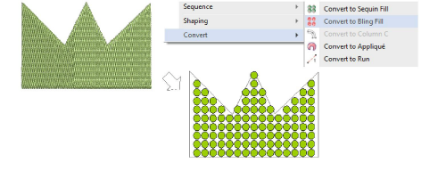
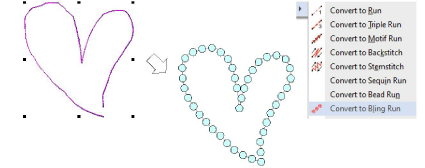
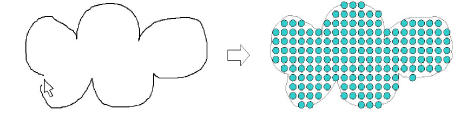

# Convert objects to bling

Any closed object can be converted to a bling-fill object. Similarly, any outline object – closed or open – can be converted to bling-run.

## To convert an object to bling...

- Right-click a fill object and select Convert > Convert to Bling Fill.

- Alternatively, click the Bling Fill button on the Bling toolbar.
- Similarly right-click a run object and select Convert > Convert to Bling Run.

::: tip
You can also create objects with the Freehand Embroidery tools which can be converted to bling-fill objects.
:::

