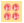

# Create bling fills

|                                  | Use Bling > Bling Fill to digitize complex shapes (with or without holes) filled with bling.                                                      |
| ---------------------------------------------------------------------- | ------------------------------------------------------------------------------------------------------------------------------------------------- |
|      | Activate Bling > Automatic Overlap Removal if you want to automatically remove unwanted overlapping bling items from a bling object.              |
|  | Activate Bling > No Automatic Overlap Removal if you don’t want to automatically remove overlapping bling items from a bling object.              |
|        | Activate Bling > Highlight Bling Overlaps if you want to highlight overlapping bling items in a bling object – i.e. if you want to edit manually. |
|                        | Use View > Show Bling to toggle bling display on/off.                                                                                             |
|        | Use Bling > Show Bling Work Area to visualize the design within the work area of the selected machine model.                                      |

The Bling Fill feature provides a means of filling complex shapes with bling arranged in columns. Bling fill types include Column Fill (straight grid, angled grid) and Contour Fill.

::: tip
You can create offset objects from bling-fill objects. All the same options are available as are available for embroidery objects, plus the ability to create bling fills and runs.
:::

## To create a bling fill...

1. Optionally, toggle on Show Bling Work Area to visualize the design within the work area of the selected machine model.

2. Click the Bling Fill button.

3. Digitize control points for a closed object in the same way as Complex Fill.

4. Press Enter to close the shape. You are prompted to create another boundary.

5. Press Enter twice to finish the object.

6. Double-click the object to view properties. The Object Properties docker opens at the Bling Fills tab.

7. Select a fill type – Column Fill or Contour Fill.

8. Adjust angles and shift as required – these settings are only available with Column Fill.

9. Use pattern settings as for sequin fills to create simple or multiline bling fills:

- For a simple fill, set the fill type to Simple and adjust pattern as desired.

- For a more complex, variegated fill, set the fill type to Multiline and adjust pattern for each line as desired.

10. Adjust line spacing settings as required.

11. Add borders as required. See below

::: tip
By default, Automatic Overlap Removal is selected in order to automatically remove unwanted items from overlapping bling objects. Choose another option if you want to manually edit rhinestone overlaps.
:::

::: info Note
Bling overlaps are determined by the Overlap Tolerance setting. This defines the minimum allowable distance between stones.
:::

## Bling fill summary

Controls available on the Bling Fill tab are summarized below.

| Control         | Description                                                                                                                                                                                                                                                                                                                                                                                                                 |
| --------------- | --------------------------------------------------------------------------------------------------------------------------------------------------------------------------------------------------------------------------------------------------------------------------------------------------------------------------------------------------------------------------------------------------------------------------- |
| Fill type       | Available fill types include: Column Fill, Contour Fill. Respectively, these fill a shape with columns along which patterns are repeated, or contours where patterns are repeated along a contoured path.                                                                                                                                                                                                                   |
| Layout          | Bling-fill objects exist in one of two ‘layout’ states: Auto and Manual. In the Auto state, bling fills are automatically re-generated whenever an object is scaled or reshaped. In the Manual state, the bling count does not change during transformations. [See also Modifying bling objects.](Modifying_bling_objects)                                                                                                  |
| Angle           | Changes the angle of the column fill. This is only applicable to Column Fill.                                                                                                                                                                                                                                                                                                                                               |
| Shift           | Moves the entire fill pattern in relation to the object outline. This can be used to achieve a more even fill placement. Acceptable values are between ±0.5.                                                                                                                                                                                                                                                                |
| Follow outlines | Expands the space between bling in each line of fill in order to follow the object outline. This results in a stronger outline demarcation. It is only applicable to Column Fill and works in conjunction with borders. [See Add bling borders for details.](Add_bling_borders)                                                                                                                                             |
| Pattern editor  | Use to create bling patterns as either single-line or multi-line patterns. Create patterns by clicking ‘+’ in the pattern editor and selecting bling from the palette. Multi-line patterns are created similarly, but each time the number of lines increases, a new tab is added to the pattern editor. This allows a new pattern to be added. [See also Creating sequin fills.](../sequin_advanced/Creating_sequin_fills) |
| Line spacing    | Set the distance between the currently active line tab and the next line in the pattern. This can be the same or different for each and every line. By default, this value is the same for each.                                                                                                                                                                                                                            |
| Border          | When checked, this adds a border to any selected bling-fill object. You can also create a pattern for the border similarly to single-line patterns for bling fills.                                                                                                                                                                                                                                                         |
| Margin          | Add a margin to rhinestones forming the border. Smaller border margins result in a larger number of rhinestones in the fill.                                                                                                                                                                                                                                                                                                |
| Orientation     | Place bling in the border either relative to the object baseline or at an absolute (fixed ‘north’) orientation.                                                                                                                                                                                                                                                                                                             |
| Statistics      | View the following information: type, SS (stone size), color, shape, count (for the selected object). If multiple objects are selected, then bling information will be displayed for all selected objects. You can re-order the columns as needed.                                                                                                                                                                          |

## Related topics...

- [Send bling to CAMS machine](../export/Send_bling_to_CAMS_machine)
- [Setting up bling palettes](Setting_up_bling_palettes)
- [Creating sequin fills](../sequin_advanced/Creating_sequin_fills)
- [Creating multi-sequin fills](../sequin_advanced/Creating_multi-sequin_fills)
