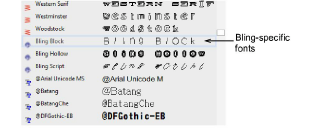
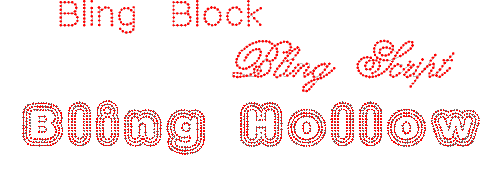

# Creating bling lettering

|  | Use Bling > Bling Lettering to create bling lettering onscreen using native bling fonts, embroidery fonts, or TrueType fonts. Right-click for settings. |
| ------------------------------------------------ | ------------------------------------------------------------------------------------------------------------------------------------------------------- |

Use the dedicated Bling Lettering tool to create lettering in the same way as embroidery lettering. Use the same properties as embroidery lettering. Depending on the font, you also have access to Bling Run or Bling Fill properties. Alternatively, various techniques exist to create bling text without lettering properties.

## To create bling lettering...

- Select the Bling Lettering tool and select a font from the Special > Lettering tab. For best results, use native bling fonts.

- Digitize bling lettering as you would embroidery lettering.

- Adjust properties as for embroidery lettering including size, slant, etc.
- Change font type. Use embroidery fonts or TrueType fonts with bling as desired.
- Alternatively, select an existing embroidery lettering object and convert to Bling Run or Bling Fill.

- Create a TrueType object and convert to Bling Run or Bling Fill.

- Create a lettering object in CorelDRAW Graphics, change to Wilcom Workspace, use Centerline Run Object to trace the letters, and convert to Bling Run.

- Depending on the font type you are using, adjust bling automatic fills or outlines for Bling Fill or Bling Run.

## Related topics...

- [Creating embroidery lettering](../../Lettering/lettering_create/Creating_embroidery_lettering1)
- [Editing text](../../Lettering/lettering_edit/Editing_text)
- [Creating bling runs & fills](Creating_bling_runs_fills)
