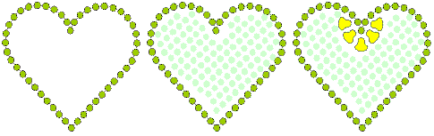

# Creating bling runs & fills

The Bling feature provides tools for creating bling runs as well as fills. The fill can include a border, with or without a margin. You have the option of digitizing individual rhinestone ‘drops’ with the manual method.

## Related topics...

- [Digitize bling runs](Digitize_bling_runs)
- [Place rhinestones manually](Place_rhinestones_manually)
- [Create bling fills](Create_bling_fills)
- [Add bling borders](Add_bling_borders)
