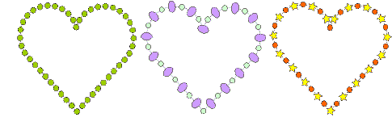

# Digitize bling runs

|            | Use Bling > Bling Run Auto to create a string of rhinestones along a digitized line according to current settings. |
| ------------------------------------------------------ | ------------------------------------------------------------------------------------------------------------------ |
|                  | Use View > Show Bling to toggle bling display on/off.                                                              |
|  | Use Bling > Show Bling Work Area to visualize the design within the work area of the selected machine model.       |

Use the Bling Run Auto method to create a string of rhinestones along a digitized line. There are two available types – Simple Run (same size stones) and Pattern Run (different sizes following a regular pattern). The system automatically generates drops according to current settings.

## To digitize a bling run...

1Set up the bling palette if you haven’t already done so.

2Optionally, toggle on Show Bling Work Area to visualize the design within the work area of the selected machine model.

3Click the Bling Run Auto icon.

4Digitize the line as you would for a normal run object – left-click for corner points, right-click for curve points.

5Press Enter to finish. Rhinestones are automatically generated. Spacings can be individually adjusted.

6Double-click the object to view properties. The Object Properties docker opens at the Bling Run tab.

Available controls are summarized below.

| Control        | Function                                                                                                                                                                                |
| -------------- | --------------------------------------------------------------------------------------------------------------------------------------------------------------------------------------- | --- |
| Pattern Editor | Use to create bling run patterns. Click ‘+’ in the pattern editor and select the desired rhinestone shape from the droplist.                                                            |
| Positioning    | Place rhinestones along the curve and adjust placement to meet selected criteria:                                                                                                       |
|                | Exact: places bling along curve according to specified spacing.                                                                                                                         |     |
|                | Expand to fit: places as many bling as possible along each curve segment where spacing is never less than specified. With this option, there are always rhinestones at each cusp point. |     |
|                | Compact: non-circular rhinestones are placed such that minimal distance between is equal to specified spacing.                                                                          |     |
|                | Manual: allows manual distribution of rhinestones along curve.                                                                                                                          |     |
| Orientation    | Place rhinestones either relative to object baseline or absolute (fixed ‘north’) orientation.                                                                                           |
| Statistics     | Summary information: type, SS (stone size), color, shape, count (for the selected object). If multiple objects are selected, bling information for all selected objects is displayed.   |

7Use pattern settings as for sequin runs to create simple or variegated bling runs.

8Set bling orientation to baseline or fixed angle.

Tip: The Backtrack/Repeat tool is enabled for bling-run objects.

## Related topics...

- [Setting up bling palettes](Setting_up_bling_palettes)
- [Send bling to CAMS machine](../export/Send_bling_to_CAMS_machine)
- [Digitizing sequin runs](../sequin_basics/Digitizing_sequin_runs)
- [Digitizing outlines & details](../../Digitizing/input/Digitizing_outlines_details)
- [Reinforce outlines](../../Quality/quality/Reinforce_outlines)
