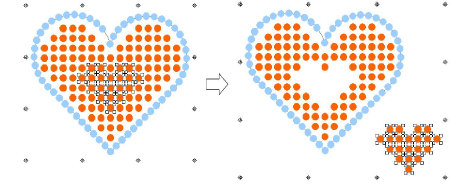

# Edit bling-fill objects

|                                            | Use Bling > Bling Edit to edit bling items individually.                                                                                          |
| -------------------------------------------------------------------------------- | ------------------------------------------------------------------------------------------------------------------------------------------------- |
|      | Activate Bling > Automatic Overlap Removal if you want to automatically remove unwanted overlapping bling items from a bling object.              |
|  | Activate Bling > No Automatic Overlap Removal if you don’t want to automatically remove overlapping bling items from a bling object.              |
|        | Activate Bling > Highlight Bling Overlaps if you want to highlight overlapping bling items in a bling object – i.e. if you want to edit manually. |

The Bling toolset provides tools for editing rhinestones individually. The following operations are applicable to bling run, bling fill, and bling manual objects.

## To edit a bling-fill object...

- Select the bling-fill object and click the Bling Edit icon. Selection handles change.

- Select rhinestones individually within the object.

Use the Ctrl key to select multiples.

- Delete or reposition selected rhinestones as desired.
- Select rhinestones and right-click to replace by means of the popup menu.

- Use the same popup menu to delete or add rhinestones.

These operations are treated as manual edits. The object’s layout status is automatically changed to Manual. This means that bling count does not change during object transformations.

::: tip
By default, Automatic Overlap Removal is selected in order to automatically remove unwanted items from overlapping bling objects. Choose another option if you want to manually edit rhinestone overlaps.
:::

::: info Note
Bling overlaps are determined by the Overlap Tolerance setting. This defines the minimum allowable distance between stones.
:::
