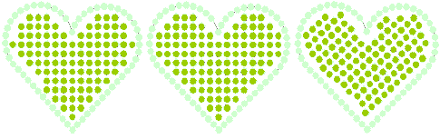

# Modifying bling objects

Bling-fill objects can be scaled and reshaped like any embroidery object. When reshaping, resizing or editing an object/design, the software automatically recalculates the number of stones but does not resize them. The Bling toolset also provides tools for editing rhinestones individually.

::: tip
Object properties for bling-run and bling-fill objects can be copied and applied to other objects. This is done via the Make Properties Current and Apply Current Properties commands.
:::

## Related topics...

- [Transform bling-fill objects](Transform_bling-fill_objects)
- [Reshape bling-fill objects](Reshape_bling-fill_objects)
- [Edit bling-fill objects](Edit_bling-fill_objects)
- [Convert objects to bling](Convert_objects_to_bling)
