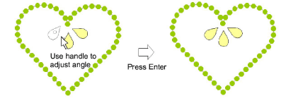

# Place rhinestones manually

|  | Use Bling > Bling Manual to digitize individual bling drops. Select from a user-defined palette of rhinestone shapes. |
| ------------------------------------------ | --------------------------------------------------------------------------------------------------------------------- |

You have the option of digitizing individual rhinestone ‘drops’ with the manual method.

## To place rhinestones manually...

- Click Bling Manual and select the bling type you want from the droplist.

- Digitize individual rhinestones by left-clicking. If you make a mistake, press Backspace.

- Holding down the Shift key, use the handle to adjust rhinestone orientation as you digitize.
- Press Enter to finish.
