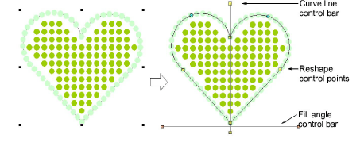
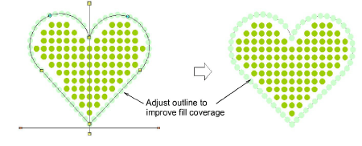
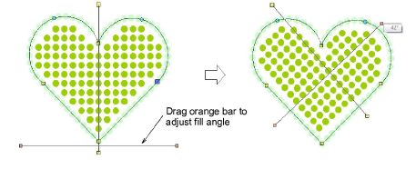
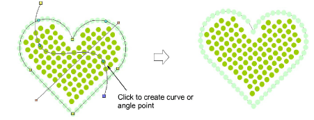

# Reshape bling-fill objects

|  | Use Select > Select Object to resize objects using selection handles. |
| ------------------------------------------------------ | --------------------------------------------------------------------- |
|          | Use Reshape > Reshape Object to reshape selected bling run objects.   |

When reshaping a bling-fill object you can reshape object outlines in the normal way. When Column Fill is applied, you can graphically change the fill angle and curve line as well.

## To reshape a bling-fill object...

- Select the bling-fill object.

- Click the Reshape icon or press the H key.

Control points appear around the object outline. If column fill is selected, two other control bars appear – one (orange handles) to control fill angle, and the other (yellow handles) to control curve lines.

- Reshape the outline in the normal way.

In this case, we adjust the outline only slightly to improve the bling fill coverage.

- Adjust fill angle control as desired.

- Adjust curve line control as desired.

Right or left-click anywhere along the line to add curve or angle points. Curve line adjustments have no effect on object properties.

