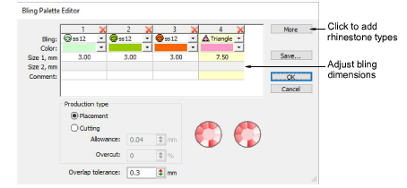
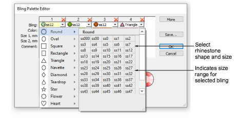
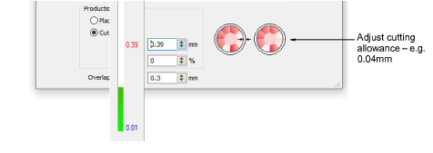
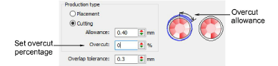
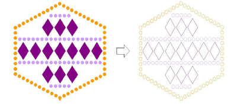
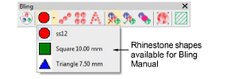
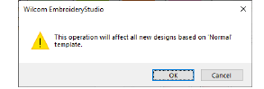

# Setting up bling palettes

|  | Use Bling > Bling Palette Editor to select and configure rhinestone shapes from a pattern library. |
| -------------------------------------------------------- | -------------------------------------------------------------------------------------------------- |

The Bling Palette Editor lets you prepare a palette of rhinestones for use in the current design. Once set up, the palette is available for use in Object Properties or from the Bling toolbar.

## To define a bling palette...

- Click the Bling Palette Editor icon.

Fields are arranged in tabular form so that parameters for each rhinestone type can be viewed at once.

::: info Note
The controls available in the Bling Palette Editor are similar to those available in the Sequin Palette Editor.
:::

- Click the More button to add new entries as required.
- Use the Bling droplist to select rhinestone type and size – e.g. ‘Round ss12’.

The droplist displays rhinestones available for use in both runs and fills. The code specifies a size range displayed at the bottom of the popup – e.g. ‘ss12’ falls within a size range of 3.00-3.20 mm.

- Edit bling colors and sizes as required. The controls are summarized below.

| Control           | Function                                                                                                                                                                                                                                                                                                                            |
| ----------------- | ----------------------------------------------------------------------------------------------------------------------------------------------------------------------------------------------------------------------------------------------------------------------------------------------------------------------------------- |
| Color             | Change colors by clicking the drop-arrow and accessing the color selection palette. Choose from a range of both standard and non-standard colors, or mix your own.                                                                                                                                                                  |
| Size1/Size2       | These are editable fields which control bling dimensions. Circles, squares, stars, flowers and triangles (equilateral) have editable width. All other shapes have both editable width and height. The units of measurement are determined by the user. [See also Set measurement units.](../../Basics/basics/Set_measurement_units) |
| Comment           | Comment is a free text field limited to a maximum of 128 characters.                                                                                                                                                                                                                                                                |
| Production type   | If you are using a cutting machine, you can adjust the ‘cutting allowance’ for rhinestones to easily fit the cut holes in the stencil. See below.                                                                                                                                                                                   |
| Overlap tolerance | Set the minimum allowable distance between stones. Once set, the software controls placement so that no stones are placed closer than this value. [See also Edit bling-fill objects.](Edit_bling-fill_objects)                                                                                                                      |
| Save              | Save the palette to the file system for use in another session.                                                                                                                                                                                                                                                                     |

- Define a Production Type for the bling palette:
- Placement: If you have an automatic or semi-automatic machine, choose this option.
- Cutting: If you have a cutting machine, you will need to cut holes in the template material a little bigger than the rhinestone size you intend to use. You can set an Allowance value, say 0.04mm, for rhinestones to easily fit within the cut holes of the stencil.

- Set an Overcut allowance (as a percentage) as necessary. This determines extra distance the knife needs to travel to ensure a clean cut. You may need to experiment with this setting depending on the cutting machine you are using.

::: info Note
Bling objects exported to a cutter retain color information, and cutting outlines have hairline width.
:::

- Click OK to confirm. Rhinestone shapes are now available for use in Object Properties or from the Bling Manual palette.

::: tip
Click Save to save bling palette to the current template. You might consider setting up a dedicated bling template.
:::

## Related topics...

- [Setting up sequin palettes](../sequin_basics/Setting_up_sequin_palettes)
- [Bling production processes](Bling_production_processes)
- [Create bling fills](Create_bling_fills)
- [Working with templates](../../Digitizing/properties/Working_with_templates)
