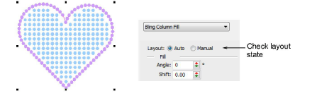
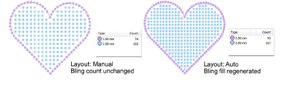
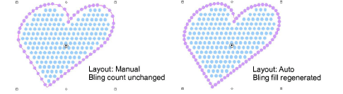

# Transform bling-fill objects

|  | Use Select > Select Object to resize objects using selection handles. |
| -------------------------------------------- | --------------------------------------------------------------------- |

Bling-fill objects can be scaled and transformed like any embroidery object with one difference. Bling-fill objects exist in one of two ‘layout’ states: Auto and Manual. In the Auto state, bling fills are automatically re-generated whenever an object is scaled or reshaped. In the Manual state, the bling count does not change during transformations.

## To transform a bling-fill object...

- Select the bling-fill object and check the Layout setting.

- Scale as desired.

- Similarly, skew as desired.

## Related topics...

- [Transforming Objects](../../Modifying/transform/Transforming_Objects)
