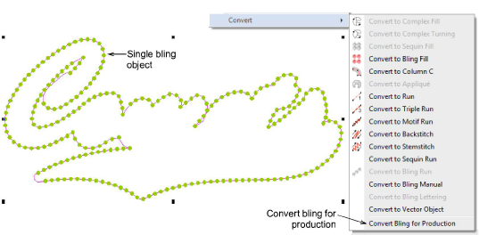
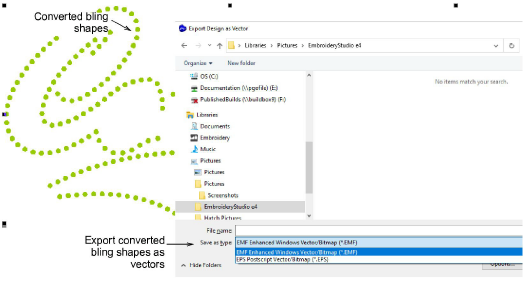
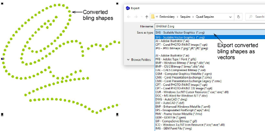

# Convert bling for production

If you have neither CAMS automatic rhinestone placement machine nor a direct-connect cutting machine, you can use the Convert Bling for Production command to convert bling objects to vector shapes. These can be then output to vector file for use by third-party applications.

Once converted, individual bling shapes can be exported as a printable file – for example, EMF or EPS – via the File > Export Design as Vector command. This in turn can be imported into cutting software as a bling template.

If your software level supports CorelDRAW Graphics, you can export the vector shapes to other formats, including SVG, FCM, DXF, and many others. These too can be used to cut a template sheet for bling design. Switch to CorelDRAW Graphics and use the File > Export command.

Note: The Export Multi-Decoration Files capability allows you to output files for multi-decoration designs. The system recognizes whether a component is embroidery, graphic, appliqué, or bling. [See also Exporting multiple decoration files.](Exporting_multiple_decoration_files)
