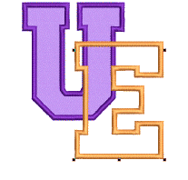
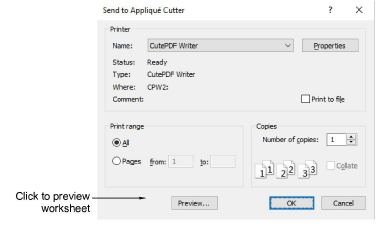
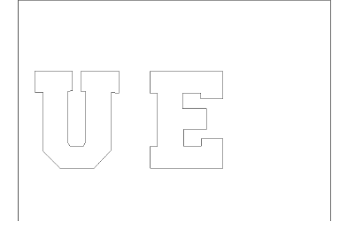

# Cut appliqué shapes

|  | Use Standard > Send to Appliqué Cutter to send appliqué shapes from design file to laser cutter. |
| ------------------------------------------------------------ | ------------------------------------------------------------------------------------------------ |

EmbroideryStudio can extract outlines from a design and send them to a laser cutter. This procedure is employed when the cutter is supported directly by a MS Windows® driver. Only shapes defining the actual appliqué fabric are sent.

Note: Before you send appliqué shapes to a cutter, make sure it is set up on your system with the correct MS Windows® (printer) driver. Some cutters – e.g. Ioline – use a standard driver for HP-7475 plotters. Once the driver is installed in MS Windows®, there is no need for a separate hardware setup in EmbroideryStudio.

## To output appliqué shapes...

1Create or open an appliqué design.

2Click Send to Appliqué Cutter or select File > Send to Appliqué Cutter.

3From the Name list, select the appliqué cutter. For more information, refer to the User Manual of the particular cutter you are using.

4Click Preview to preview the pattern. The Print Preview dialog opens showing every appliqué shape in the order of the stitching sequence.

5Click Print Now to output appliqué shapes to cutter.
