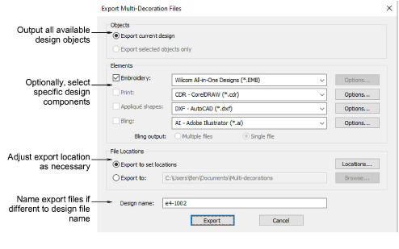
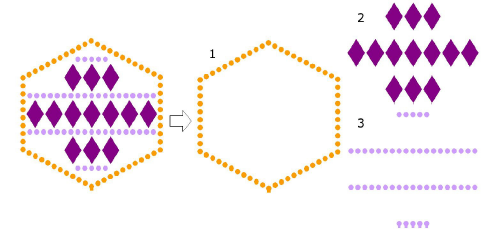
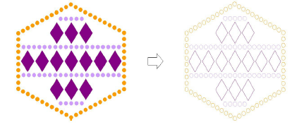
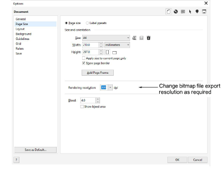
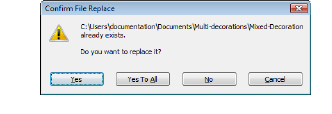

# Export design components

|  | Use Standard > Export Multi-Decoration Files to export all design components requiring different production processes. |
| ------------------------------------------------------------------------ | ---------------------------------------------------------------------------------------------------------------------- |

The Export Multi-Decoration Files capability allows you to output files for multi-decoration designs. The system recognizes whether a component is embroidery, graphic, appliqué, or bling. This, in turn, helps to increase the profitability of ‘quantity 1’ articles. It can provide:

- Direct input to supported machines, as this is the most efficient method, or
- A file format which can be used directly by the machine’s supporting software.

::: info Note
If the printer, appliqué, or bling machine is directly supported, this procedure is not required. For example, cutting appliqués or outputting bling templates have their own procedures.
:::

## To export design components...

1. Open the multi-decoration design you want to output.

2. Click the Export Multi-Decoration Files icon.

3. Select Export Current Design if you want to output all design objects.

This is the default option and, unless you have pre-selected certain objects for inclusion, the only option.

4. Optionally, select the multi-decoration components you want to export by ticking the relevant checkbox in the Elements pane.

5. If you have selected Bling as one of your export components, optionally select Multiple Files or Single File.

When Multiple Files is selected, different bling types – i.e. by size, color, and/or shape – will be output to separate files. Multiple file output is important for the manual flood-fill method of creating rhinestone templates.

::: tip
Depending on your cutting machine, you may choose to export cutting outlines only. Preset in the Bling Palette Editor. Bling objects exported this way retain color information, and cutting outlines have hairline width.
:::

6. For each component, select required file types from the droplist.

If you select an embroidery format, an associated Options button may be enabled. For bling, you can choose AI format for semi-automatic machines. For any other cutting machines, you can save directly to CDR format.

7. Optionally, click the Options button if available.

If no options are set, the system uses default options for each file format. If a selected file type is PNG, design components are exported with transparency on. Defaults are as follows:

- Color mode: RGB color (24Bit)
- Transparency: On
- Anti-alias: On
- Maintain aspect ratio: On
- Resolution: 300 DPI

The default DPI setting can be changed via the CorelDRAW Options dialog.

8. Select an export location:

- Export to set locations (the default): preset locations for different files. In some production environments, each file is placed in a network location where it can be used by the operator of that process.
- Export to: specify a location for all files – e.g. external USB stick. Folders are rarely changed once established, but occasionally they may need to be adjusted or temporarily overridden.

9. Optionally, enter a filename to be used by all selected multi-decoration components. If no filename is entered, the system will use the design filename by default.

10. Click Export. The system writes all selected components to their specified location/s.

- If no file types have been selected, the Locations dialog will display. You can set default file types at this stage or cancel out.
- If files have the same file extension and location, filenames will be created with a component suffix.
- If a file/s already exists in target folder/s, the system will give you the option to overwrite, skip, or cancel the process.

- If the embroidery file output contains team names, the system will display the team names Output Option dialog.

## Related topics...

- [Exporting multiple decoration files](Exporting_multiple_decoration_files)
- [Set export locations](Set_export_locations)
- [File naming conventions](File_naming_conventions)
- [Embroidery file formats](../../Management/formats/Embroidery_file_formats)
- [Supported machine types](../../Management/formats/Supported_machine_types)
- [Output to bling cutter](Output_to_bling_cutter)
- [Cut appliqué shapes](Cut_appliqué_shapes)
- [Setting up bling palettes](../bling/Setting_up_bling_palettes)
- [Outputting teamname designs](../../Lettering/lettering_names/Outputting_teamname_designs)
