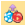
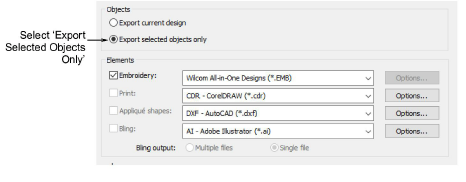
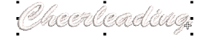

# Export selected objects

|  | Use Standard > Export Multi-Decoration Files to export all design components requiring different production processes. |
| ---------------------------------------------------------------------------------- | ---------------------------------------------------------------------------------------------------------------------- |

On occasion, you may want to export only selected objects from your multi-decoration design. The Export Multi-Decoration Files capability allows you to pre-select objects in the design window.

## To export selected objects...

1. Open or create a multi-decoration design.

2. Select the individual objects you want to export. In the example below, we will export the word ‘Cheerleading’ only.

3. Click the Export Multi-Decoration Files icon.

4. Select the Export Selected Objects Only option. This checkbox will appear only if you have selected objects in the design window.

5. Make location adjustments as necessary and click Export. Only selected objects are exported to file.

## Related topics...

- [Export design components](Export_design_components)
